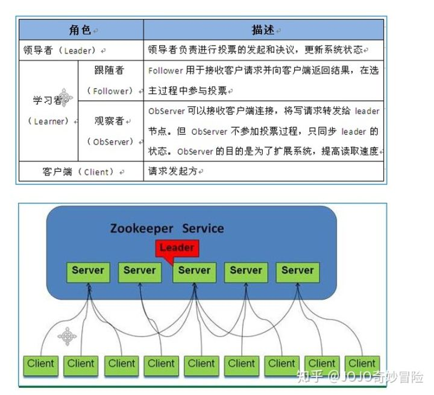
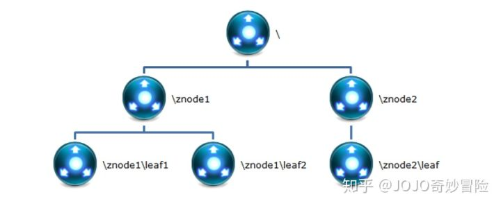

# 集群下载

https://kafka.apache.org/downloads#2.4.1



# 准备工作

# 安装

1.  解压包 

   ```bash
   tar xf apache-zookeeper-3.5.5-bin.tar.gz
   ```

2. 修改配置

   ```bash
    cp zookeeper/conf/zoo_sample.cfg zookeeper/conf/zoo.cfg
   ```

    zoo.cfg

   ```preoperties
    dataDir=/data/zookeeper
    
    server.255=node00:2888:3888
    server.1=node01:2888:3888
    server.2=node02:2888:3888
    server.3=node03:2888:3888
    server.4=node04:2888:3888
   ```

   > zookeeper 数据文件存放的目录
   >
   > 指定zookeeper集群中各个机器的信息：
   >
   > server后面的数字范围是1到255，所以一个zookeeper集群最多可以有255个机器

3. 分发zookeeper到机器中

   ```bash
   scp -rp zookeeper node1:/usr/local
   ```

4. 配置每台机器上的 myid  

   ```bash
   zookeeper/data
   echo 1 > /data/zookeeper/myid
   ```

   >  每台服务其上对应server后面的数字写到myid文件中，myid文件地址为dataDir地址

.zookeeper正常启动运行是需要3个以上并且最好是奇数的节点的

# 启动关闭

每台机器上执行

```bash
zookeeper/bin/zkServer.sh start
```

```bash
zookeeper/bin/zkServer.sh stop
```


# 验证

 1. jps 检查进程确认状态

    ```bash
    [root@node4 ~]# jps
    4661 Jps
    4574 QuorumPeerMain
    [root@node4 ~]# 
    [root@node4 ~]#  /usr/local/zookeeper/bin/zkServer.sh status
    ZooKeeper JMX enabled by default
    Using config: /usr/local/zookeeper/bin/../conf/zoo.cfg
    Client port found: 2181. Client address: localhost.
    Mode: follower
    [root@node4 ~]#  
    ```

 2. 客户端命令验证

    ```bash
    zookeeper/bin/zkCli.sh
    ```

 3. zookeeper很像一个小型的文件系统，/是根目录，下面的所有节点都

    叫zNode。

# FQA：

Q：

```bash
2020-04-01 12:33:52,912 [myid:] - INFO  [main:ClientCnxn@1653] - zookeeper.request.timeout value is 0. feature enabled=
Welcome to ZooKeeper!
2020-04-01 12:33:52,919 [myid:192.168.122.32:2182] - INFO  [main-SendThread(192.168.122.32:2182):ClientCnxn$SendThread@1112] - Opening socket connection to server node2/192.168.122.32:2182. Will not attempt to authenticate using SASL (unknown error)
JLine support is enabled
2020-04-01 12:33:52,968 [myid:192.168.122.32:2182] - INFO  [main-SendThread(192.168.122.32:2182):ClientCnxn$SendThread@1244] - Socket error occurred: node2/192.168.122.32:2182: 拒绝连接
[zk: 192.168.122.32:2182(CONNECTING) 0] 2020-04-01 12:33:54,073 [myid:192.168.122.32:2182] - INFO  [main-SendThread(192.168.122.32:2182):ClientCnxn$SendThread@1112] - Opening socket connection to server node2/192.168.122.32:2182. Will not attempt to authenticate using SASL (unknown error)
2020-04-01 12:33:54,075 [myid:192.168.122.32:2182] - INFO  [main-SendThread(192.168.122.32:2182):ClientCnxn$SendThread@1244] - Socket error occurred: node2/192.168.122.32:2182: 拒绝连接
2020-04-01 12:33:55,176 [myid:192.168.122.32:2182] - INFO  [main-SendThread(192.168.122.32:2182):ClientCnxn$SendThread@1112] - Opening socket connection to server node2/192.168.122.32:2182. Will not attempt to authenticate using SASL (unknown error)
2020-04-01 12:33:55,178 [myid:192.168.122.32:2182] - INFO  [main-SendThread(192.168.122.32:2182):ClientCnxn$SendThread@1244] - Socket error occurred: node2/192.168.122.32:2182: 拒绝连接
2020-04-01 12:33:56,280 [myid:192.168.122.32:2182] - INFO  [main-SendThread(192.168.122.32:2182):ClientCnxn$SendThread@1112] - Opening socket connection to server node2/192.168.122.32:2182. Will not attempt to authenticate using SASL (unknown error)
2020-04-01 12:33:56,282 [myid:192.168.122.32:2182] - INFO  [main-SendThread(192.168.122.32:2182):ClientCnxn$SendThread@1244] - Socket error occurred: node2/192.168.122.32:2182: 拒绝连接
2020-04-01 12:33:57,384 [myid:192.168.122.32:2182] - INFO  [main-SendThread(192.168.122.32:2182):ClientCnxn$SendThread@1112] - Opening socket connection to server node2/192.168.122.32:2182. Will not attempt to authenticate using SASL (unknown error)

```

A:

> 1. 检查zkServer.sh status
>
> 2. 检查zoo.cfg 和 /etc/hosts 是否一直
>
> 3. 检查防火墙
>
> 4. 重新部署，
>
>    1. zkServer.sh stop
>    2. 新集群可以删除调 zoo.cfg 中 dirDirect目录下 version-2 
>    3. zkServer.sh start
>
>    
>
> 5. 可能稍等恢复


# ZooKeeper简介

### ZooKeeper 的作用 

> 主要功 能包括：配置管理、名字服务、分布式锁、集群管理

### Zookeeper 的存储结构 



+ Znode 

> znode 是一个跟 Unix 文件系统路径相似的节点，可以往这个节点存储 或获取数据。 
>
> Zookeeper  底层是一套数据结构。这个存储结构是一个树形结构，其上的每一个节点， 我们称之为“znode” zookeeper  中的数据是按照“树”结构进行存储的。
>
> 而且 znode 节点还分为 4 中不同的类 型。
>
> 每一个 znode 默认能够存储 1MB  的数据（对于记录状态性质的数据来说，够了） 可以使用 zkCli 命令，登录到 zookeeper 上，并通过  ls、create、delete、get、set 等命令 操作这些 znode 节点 

+ Znode 节点类型 

  + PERSISTENT 持久化节点

    所谓持久节点，是指在节点创建后，就一直存在，直到 有删除操作来主动清除这个节点。

    否则不会因为创建该节点的客户端会话失效而消失。

  + PERSISTENT_SEQUENTIAL 持久顺序节点：

    这类节点的基本特性和上面的节点类 型是一致的。

    额外的特性是，在 ZK 中，每个父节点会为他的第一级子节点维护一份时序，  会记录每个子节点创建的先后顺序。

    基于这个特性，在创建子节点的时候，可以设置这个属 性，那么在创建节点过程中，ZK  会自动为给定节点名加上一个数字后缀，作为新的节点名。 这个数字后缀的范围是整型的最大值。 在创建节点的时候只需要传入节点 “/test_”，这样 之后，zookeeper 自动会给”test_”后面补充数字。 

  + EPHEMERAL  临时节点：

    和持久节点不同的是，临时节点的生命周期和客户端会话绑定。也就是说，如果客户端会话失效，那么这个节点就会自动被清除掉。

    注意，这里提到的是会话失效，而非连接断开。另外，在临时节点下面不能创建子节点。 这里还要注意一件事，就是当你客户端会话失效后，所产生的节点也不是一下子就消失 了，也要过一段时间，大概是 10  秒以内，可以试一下，本机操作生成节点，在服务器端用 命令来查看当前的节点数目，你会发现客户端已经 stop，但是产生的节点还在。 

  + EPHEMERAL_SEQUENTIAL 临时自动编号节点：

    此节点是属于临时节点，不过带有顺序，客户端会话结束节点就消失。

### 控制台客户端常用命令 

1. connect host:port - 连接其他的 ZooKeeper 应用。 

2. ls path - 列表路径下的资源。在 ZooKeeper 控制台客户端中，没有默认列表功能，必须 指定要列表资源的位置。 如： ls /  ；  ls /path 等。 

3. create [-e] [-s] path data - 创建节点，如： 

   + create /test 123 创建一个/test 节点，节点携 带数据信息 123。

   + create -e /test 123 创建一个临时节点/test，携带数据为 123，临时节点只 在当前会话生命周期中有效，会话结束节点自动删除。 

   + create -s /test 123 创建一个顺序节点 /test，携带数据123，创建的顺序节点由ZooKeeper自动为节点增加后缀信息，如-/test00000001 等。
   + -e 和-s 参数可以联合使用。 

4. get path - 查看指定节点的数据。 如： get /test。

5. set path data [version] - 设置对应位置节点的数据。如： set /test 'test data'。

   如果要设置的数据中有空格，则使用单引号界定数据的范围。

   每次修改数据后，dataVersion 属性自增。 

   那么在 set 命令中可以指定  version，version 数据必须与上次查询的值一致，用于保证本次修 改命令执行时，没有其他会话修改此数据。

6. delete path [version] - 删除指定节点，此命令不能删除有子节点的节点。如：delete /test。 

   其中 version 参数和 set 命令的 version 含义一致 rmr path - 删除指定结点，包括子节点。

7.  quit - 退出控制台 

# 单机版

###  Zookeeper 目录结构 

>1. bin：放置运行脚本和工具脚本，如果是 Linux 环境还会有有 zookeeper 的运 行日志 zookeeper.out 
>2. conf：zookeeper 默认读取配置的目录，里面会有默认的配置文件
>3. contrib：zookeeper 的拓展功能 
>4. dist-maven：zookeeper的 maven 打包目录
>5. docs：zookeeper 相关的文档 
>6. lib：zookeeper 核心的 jar 
>7. recipes：zookeeper 分布式相关的 jar 包 
>8. src：zookeeper 源码 

###   配置 Zookeeper 

> Zookeeper 在启动时默认的去 conf 目录下查找一个名称为 zoo.cfg 的配置文件。 
>
>  在 zookeeper 应用目录中有子目录  conf。
>
> 其中有配置文件模板：zoo_sample.cfg cp zoo_sample.cfg zoo.cfg。
>
> zookeeper  应用中的配置文件为 conf/zoo.cfg。 
>
> 修改配置文件 zoo.cfg - 设置数据缓存路径
