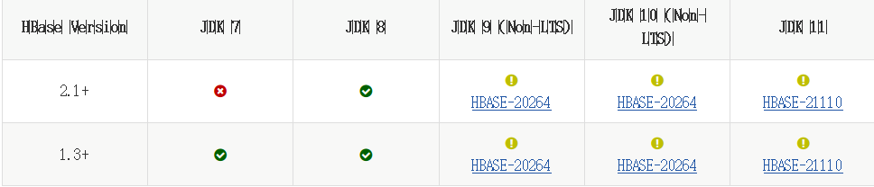

# hbase
http://hbase.apache.org/book.html#configuration

支持版本

http://hbase.apache.org/book.html#java



http://hbase.apache.org/book.html#hadoop


+ 单机版模式，
  + 单机版模式，常用于本地开发
+ 伪集群模式，
  + 单机使用HBase自带的zookeeper
+ 使用HBase自带的zookeeper构建分布式集群
  + 多台机器使用HBase自带的zookeeper
+ 使用独立安装的zookeeper构建分布式集群
  + 多台机器使用HBase 单独安装zookeeper

## 单机模式

### 环境配置 hbase-env.sh

```bash
HBASE_MANAGES_ZK=true,表示由hbase自己管理zookeeper，不需要单独的zookeeper，HBASE_MANAGES_ZK=false则表示使用独立部署的zookeeper
export HBASE_MANAGES_ZK=true
```

### 参数配置hbase-site.xml

```xml
<configuration>
    <property>
        <name>hbase.rootdir</name>
        <value>file:///data/hbase</value>
    </property>
</configuration>
```

### 启动关闭

```bash
bin/start-hbase.sh
bin/start-stop.sh
```

### 检查命令

```bash
bin/hbase shell
> # 创建表
> create 'student','Sname','Ssex','Sage','Sdept','course'
> # 创建表示指定保存的版本数
> create 'teacher',{NAME=>'username',VERSIONS=>5} 
> # 查看表详情
> describe 'student'
> list
> # 插入数据
> put 'student','95001','Sname','LiYing'
> put 'student','95001','Ssex','Male'
> put 'student','95001','course:math','80'
> put 'student','95001','course:english','90'
> # 查询
> get 'student','95001'
> get 'student','95001','course:math'
> scan 'student'
> # 删除
> delete 'student','95001','Ssex'
> deleteall 'student','95001'
> # 
> # 修改 没有直接接口
```

## 伪集群模式

### 环境配置 hbase-env.sh

```bash
HBASE_MANAGES_ZK=true,表示由hbase自己管理zookeeper，不需要单独的zookeeper，HBASE_MANAGES_ZK=false则表示使用独立部署的zookeeper
export HBASE_MANAGES_ZK=true
# 表示使用hdfs作为HBase的储存。
export HBASE_CLASSPATH=$HADOOP_HOME/etc/hadoop
```

### 参数配置hbase-site.xml

```xml
<configuration>
	    <!-- 用于指定HBase数据的存储位置，此时已经使用了hdfs。 -->
            <property>
                <name>hbase.rootdir</name>
                <value>hdfs://master:8020/hbase</value>
            </property>
	    <!-- hbase.cluster.distributed设置集群处于分布式模式; -->
            <property>
                <name>hbase.cluster.distributed</name>
                <value>true</value>
            </property>
        </configuration>
```

### 启动关闭

> hdfs 必须先启动

```bash
bin/start-hbase.sh
bin/start-stop.sh
```

### 检查命令

> 同单机模式的检查命令

## 集群模式---自带zookeeper的部署

master node[1-4] 五台机器

### 环境配置 hbase-env.sh

```bash
HBASE_MANAGES_ZK=true,表示由hbase自己管理zookeeper，不需要单独的zookeeper，HBASE_MANAGES_ZK=false则表示使用独立部署的zookeeper
export HBASE_MANAGES_ZK=true
# 表示使用hdfs作为HBase的储存。
export HBASE_CLASSPATH=$HADOOP_HOME/etc/hadoop
```

### 参数配置hbase-site.xml

```xml
<configuration>
    <!-- 用于指定HBase数据的存储位置，此时已经使用了hdfs。 -->
    <property>
        <name>hbase.rootdir</name>
        <value>hdfs://master:8020/hbase</value>
    </property>
    <!-- hbase.cluster.distributed设置集群处于分布式模式; -->
    <property>
        <name>hbase.cluster.distributed</name>
        <value>true</value>
    </property>
    <!-- 指定hbase的hmaster的主机名和端口  -->
    <property>
        <name>hbase.master</name>
        <value>master:6000</value>
    </property>
    <!-- 指定使用zookeeper的主机地址，必须是奇数个 -->
    <property>
        <name>hbase.zookeeper.quorum</name>
        <value>master:2181,node1:2181,node2:2181,node3:2181,node4:2181</value>
    </property>
    <!-- 指定zookeeper数据存储目录，默认路径是/tmp，如果不配置，重启之后数据将被清空。  -->
    <property>
        <name>zookeeper.znode.parent</name>
        <value>/hbase</value>
    </property>
    <property>
        <name>hbase.zookeeper.property</name>
        <value>/data/zookeeper/hbase</value>
    </property>
</configuration>
```

### 节点配置regionservers

>  conf/regionservers

```conf
​```conf
node1
node2
node3
node4
​```
```

### 启动关闭

> hdfs 必须先启动
>
> zookeeper自动在hbase中启动

```bash
bin/start-hbase.sh
bin/start-stop.sh
```

### 检查命令

> 同单机模式的检查命令

+ master上节点启动进程
  + HMaster、HQuorumPeer
+ slave节点上启动进程
  + HRegionServer、HQuorumPeer

## 集群模式---依赖外部zookeeper的部署

### zookeeper 部署 

> 见zookeeper安装

### 环境配置 hbase-env.sh

conf/hbase-env.sh

```bash
export JAVA_HOME=$JAVA_HOME
export HBASE_CLASSPATH=$HADOOP_HOME/etc/hadoop
# HBASE_MANAGES_ZK=false,表示不使用hbase自带的zookeeper，而使用独立部署的zookeeper
export HBASE_MANAGES_ZK=false
```

### 参数配置hbase-site.xml

conf/hbase-site.xml

```xml
<configuration>
    <property>
        <name>hbase.rootdir</name>
        <value>hdfs://master:8020/hbase</value>
    </property>
    <property>
        <name>hbase.cluster.distributed</name>
        <value>true</value>
    </property>
    <property>
        <name>hbase.master</name>
        <value>master:6000</value>
    </property>
    <property>
        <name>hbase.zookeeper.quorum</name>
        <value>slave1:2181,slave2:2181,slave3:2181</value>
    </property>
    <property>
        <name>zookeeper.znode.parent</name>
        <value>/hbase</value>
    </property>
    <property>
        <name>hbase.zookeeper.property</name>
        <value>/data/zookeeper/data</value>
    </property>
</configuration> 
```

### 节点配置regionservers

```conf
node1
node2
node3
node4
```

### 启动关闭

> hdfs 必须先启动
>
> zookeeper需要先启动

```bash
bin/start-hbase.sh
bin/start-stop.sh
```

### 检查命令

> 同单机模式的检查命令

+ master上节点启动进程
  + HMaster、HQuorumPeer
+ slave节点上启动进程
  + HRegionServer、HQuorumPeer

## 监控