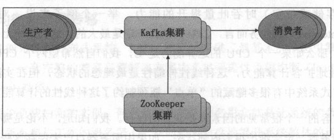
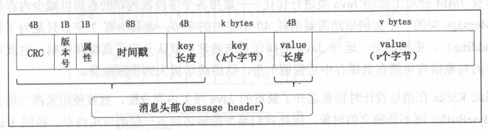
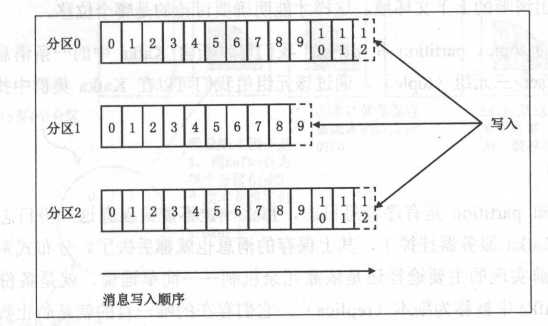
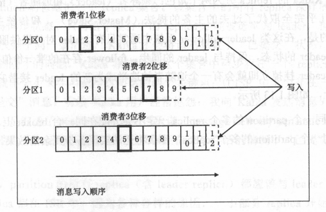

Kafka

# 下载

https://kafka.apache.org/downloads

# 准备

zookeeper 安装

>启动Zookeeper
>
>直接使用其自带的Zookeeper建立集群

直接使用其自带的Zookeeper建立集群

> bin/zookeeper-server-start.sh
>
> bin/zookeeper-server-stop.sh
>
> 对应的配制文件是config/zookeeper.properties
>
> 通过 -daemon参数，可以在后台启动Zookeeper，输出的信息在保存在执行目录的logs/zookeeper.out
>
> ```bash
> bin/zookeeper-server-start.sh -daemon config/zookeeper.properties
> ```

| ip             | zookeeper | kafka |
| -------------- | --------- | ----- |
| 192.168.122.30 | OK        | OK    |
| 192.168.122.31 | OK        | OK    |
| 192.168.122.32 | OK        | OK    |
| 192.168.122.33 | OK        | OK    |
| 192.168.122.34 | OK        | OK    |


# 安装

1. 解压包

   ```bash
    tar xvf kafka_2.12-2.4.1.tgz
   ```

2. 修改配置

   config/server.properties

   broker.id是kafka broker的编号，集群里每个broker的id需不同。我是从0开始。

   ```bash
   sed -i 's/^broker.id=0$/broker.id=1/'  config/server.properties
   ```

   listeners是监听地址，需要提供外网服务的话，要设置本地的IP地址

   ```bash
   listeners=PLAINTEXT://192.168.122.30:9092
   ```

   log.dirs是日志目录，需要设置

   ```bash
   sed -i 's/log.dirs=\/tmp\/kafka-logs/log.dirs=\/data\/kafka\/logs/' config/server.properties
   ```

   zookeeper.connect 设置Zookeeper集群地址

   ```bash
   sed -i 's/^zookeeper.connect=localhost:2181$/zookeeper.connect=node0:2181,node1:2181,node2:2181,node3:2181,node4:2181/' config/server.properties
   ```

   num.partitions 为新建Topic的默认Partition数量，partition数量提升，一定程度上可以提升并发性

   ```bash
   sed -i 's/^num.partitions=1$/num.partitions=3/' config/server.properties
   ```

   default.replication.factor为kafka保存消息的副本数，如果一个副本失效了，另一个还可以继续提供服务，是在自动创建topic时的默认副本数，可以设置为3。两个内部topic: __consumer_offsets和__transaction_state

3. 复制

   ```bash
   sed -i 's/^broker.id=0$/broker.id=1/'  config/server.properties
   ```

   ```bash
   listeners=PLAINTEXT://192.168.122.31:9092
   ```

4. 启动和关闭

   ```bash
   bin/kafka-server-start.sh -daemon config/server.properties
   bin/kafka-server-stop.sh config/server.properties
   ```

# 测试

创建topic

```bash
bin/kafka-topics.sh --create  --replication-factor 2 --partitions 5 \
    --zookeeper node0:2181,node1:2181,node2:2181,node3:2181,node4:2181 \
    --topic test
```

查看主题

```bash
bin/kafka-topics.sh --list --zookeeper node0:2181,node1:2181,node2:2181,node3:2181,node4:2181
```

发送消息

```bash
bin/kafka-console-producer.sh --broker-list 192.168.122.30:9092 --topic test
```

接收消息

```bash
bin/kafka-console-consumer.sh --bootstrap-server 192.168.122.30:9092 --topic test --from-beginning
bin/kafka-console-consumer.sh --bootstrap-server 192.168.122.31:9092 --topic test --from-beginning
bin/kafka-console-consumer.sh --bootstrap-server 192.168.122.34:9092 --topic test --from-beginning
```

查看特定主题的详细信息

```bash
bin/kafka-topics.sh  --describe \
    --zookeeper node0:2181,node1:2181,node2:2181,node3:2181,node4:2181 \
    --topic test
```

删除主题

auto.create.topics.enable = false，并认真把生产和消费程序彻底全部停止

server.properties **设置 delete.topic.enable=true**

```bash
bin/kafka-topics.sh --delete \
 --zookeeper node0:2181,node1:2181,node2:2181,node3:2181,node4:2181 \
 --topic test
```

# 基本概念

### 分布式流式处理平台



- 生产者发送消息给 Kafka 服务器。
- 消费者从 Kafka 服务器读取消息。
- Kafka 服务器依托 ZooKeeper 集群进行服务的协调管理 。



### kafka的消息具有以下特性

- 首先， Kafka 中的消息格式由很多字段组成，其中的很多宇段都是用于管理消息的元数据宇段，对用户来说是完全透明的。
- Kafka 使用紧凑的二进制字节数组来保存上面这些字段， 设计时特意避开了繁重的 Java 堆上内存分配，使用**页缓存**

### topic和partition

> 每一个Topic被切分为多个Partitions；
> 消费者数据少于或等于Partition的数目；
> Broker Group 中的每一个Broker保存Topic的一个或多个Partitions；
> Consumer Group 中仅有一个Comsumer读取Topic的一个或多个Partitions，并且是唯一的Consumer；

+ topic 是一个逻辑概念，代表了一类消息。通常我们可以使用不同的 topic 来区分不同的业务。

+ 每个 Kafka topic 都由若干个 partition 组成，Kafka 的 partition 是不可修改的有序消息日志。用户对partition 唯一能做的操作就是在消息序列的尾部追加写入消息。每条消息会被分配一个初始的序列号，可以唯一定位到某 partition 下的一条消息，成为消息位移（offset）

### offset

Kafka 生产者位移（ offset）的概念



Kafka 消费者位移（ offset）的概念




+ 每条消息在某个 partition 的位移是固定的，但消费该 partition 的消费者的位移会随着消费进度不断前移
   -消费者位移不可能超过该分区最新一条消息的位移 。

Kafka 中的一条消息其实就是一个三元组（tuple）[topic, partition, offset]，通过该元组值我们可以在 Kafka 集群中找到唯一对应的那条消息。

### repliacation

> 当集群中有Broker挂掉的情况，系统可以主动地使Replicas提供服务；
> 系统默认设置每一个Topic的replication系数为1，可以在创建Topic时单独设置；
> Replication的基本单位是Topic的Partition；
> 所有的读和写都在Leader上进行，Followers只是做为备份；

partition 是有序消息日志，为了实现高可靠性，Kafka保存了多个备份日志，在 Kafka 中被称为**副本（ replica ）**，它们存在的唯一目的就是**防止数据丢失**。

副本分为两类：领导者副本（ leader replica ）和追随者副本（ follower replica ）

+ leader 对外提供服务

+ follower 只是被动地追随 leader 的状态，保持与 leader 的同步。

  follower 存在的唯一价值就是充当 leader的候补：一旦 leader 挂掉立即就会有一个追随者被选举成为新的 leader 接替它的工作。

### ISR

就是与 leader replica 保持同步的 replica 集合。Kafka 为 partition 动态维护 一个 replica 集合。

该集合 中的所有 replica ：

- 保存的消息日志都与leader replica 保持同步状态。
- 只有这个集合中的 replica 才能被选举为 leader，
- 只有**该集合中所有 replica 都接收到了同一条消息， Kafka 才会将该消息置于“己提交”状态**，即认为这条消息发送成功。

> partition 的所有 replica （含 leader replica ）都应该与 leader replica 保持同步，即所有 replica 都在 ISR 中。但是因为各种各样的原因，可能存在 replica 开始落后于 leader replica 的进度 。滞后一定程度 Kafka 会将这些 replica “踢”出 ISR，同时追上之后的replica也可以被重新加入到ISR。


Producer : 消息和数据的生产者，向Kafka的一个Topic发布消息的进程、代码或服务；

Consumer : 消息和数据的消费者，订阅数据（Topic）并且处理其发布的消息的进程、代码或服务；

Consumer Group : 逻辑概念，对于同一个topic，会广播给不同的group，一个group中，只有一个consumer可以消费该消息；

Broker : 物理概念，Kafka集群中的每个Kafka节点；

Topic : 逻辑概念，Kafka消息的类别，对数据进行区分、隔离；

Partition : 物理概念，Kafka下数据存储的基本单位，一个Topic数据会被分散存储在多个Partition中，每个Partition中的消息是有序的；

Replication : 同一个Partition可能会有多个Replia，多个Replica之间数据一般是一样的；

Replication Leader : 一个Partition的多个Replica上，需要一个Leader负责该Partition上与Producer和Consumer交互；

Replication Manager : 负责管理当前broker所有分区和副本的信息，处理KafkaController发起的一些请求，副本状态的切换、添加/读取消息等。

> ```bash
> bin/kafka-topics.sh --create --bootstrap-server localhost:9092 --partitions 3 --topic [topicName]
> ```
>
> ```bash
> bin/kafka-topics.sh --create --bootstrap-server localhost:9092 --partitions 3 --replication-factor 2 --topic [topicName]
> ```
>
> ```bash
> bin/kafka-console-producer.sh --broker-list localhost:9092 --topic [topicName]
> ```
>
> ```bash
> bin/kafka-console-consumer.sh --bootstrap-server localhost:9092 --topic [topicName] --from-beginning
> ```
>
> 